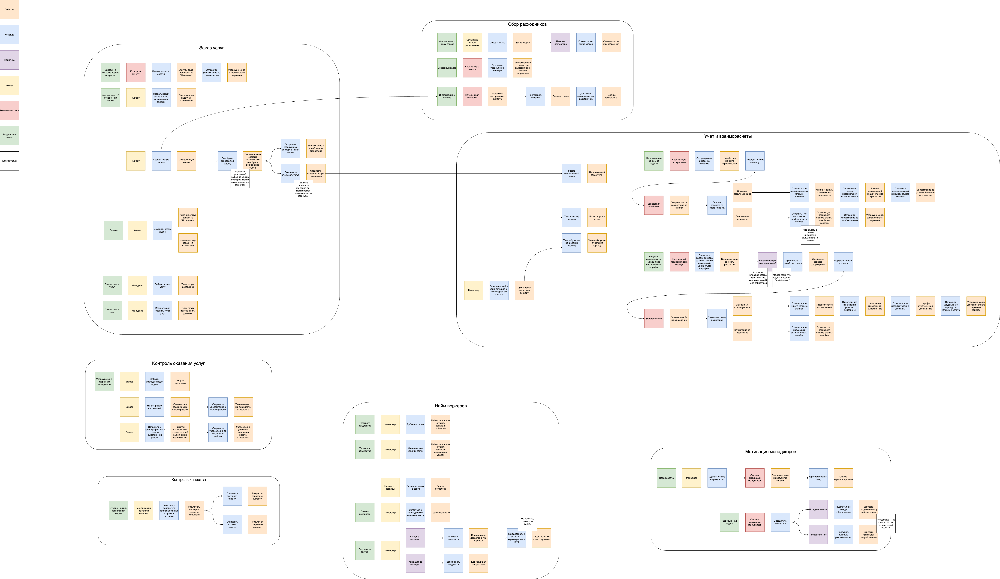
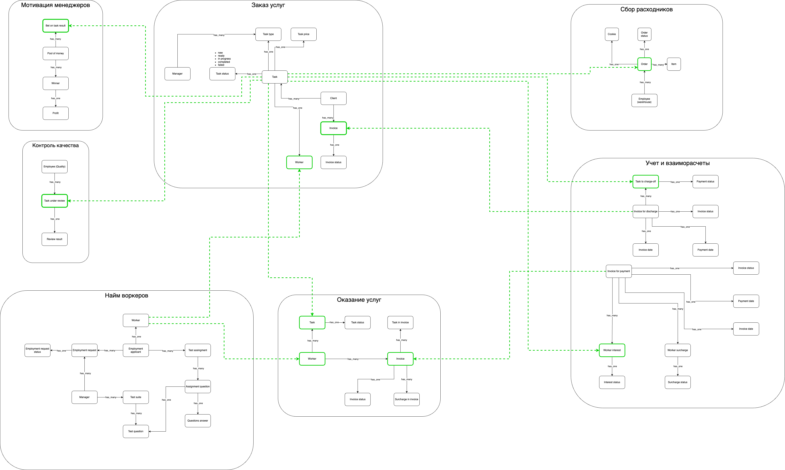

# Make cats free again (MCF)

## Event storming

## Модель данных

## Реализация проекта

Для реализации проекта выбрана [микро]сервисная архитектура. Основным подходом к реализации предлагаю использовать event sourcing. 

Анализ требований показал, что основные элементы модели данных присутствуют в большинстве связанных контекстов. Представления моделей в разных контекстах отличаются. Используя событийно оринтированный подход мы сможем в каждом сервисе оперировать только нужным и характерным ему набором атрибутов сущностей. Так же событийно ориентированный подход позволит избежать дополнительных коммуникаций между сервисами для получения дополнительных данных: сервис будет иметь всю необходимую ему информацию из событий.  
