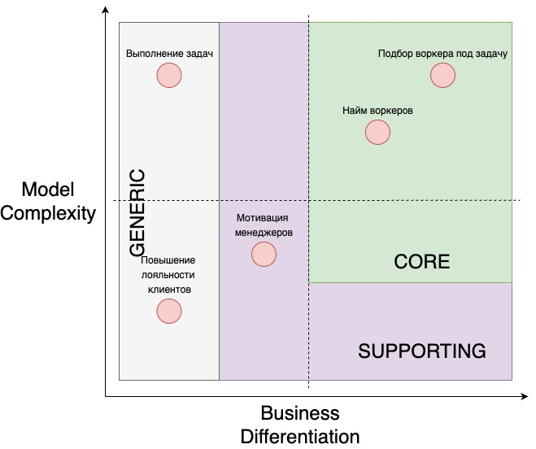
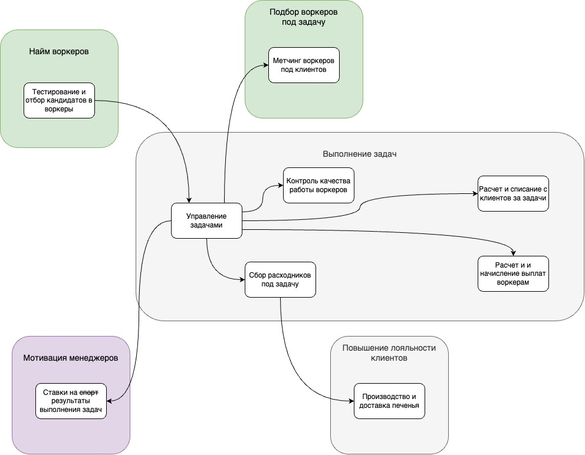
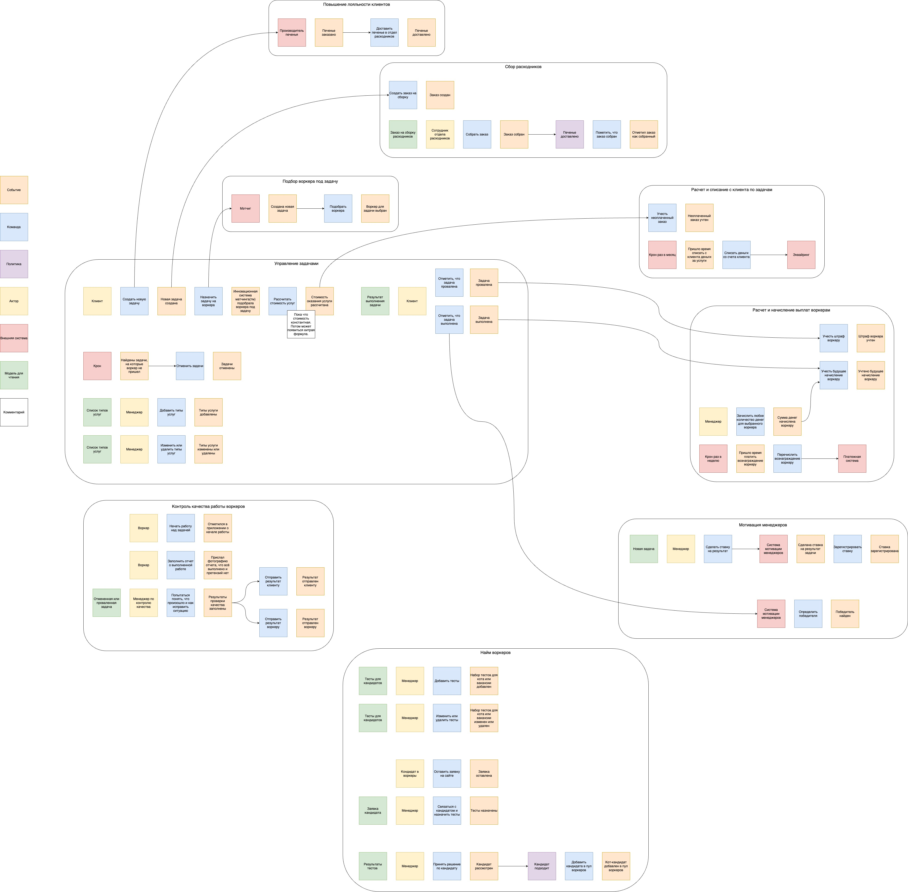
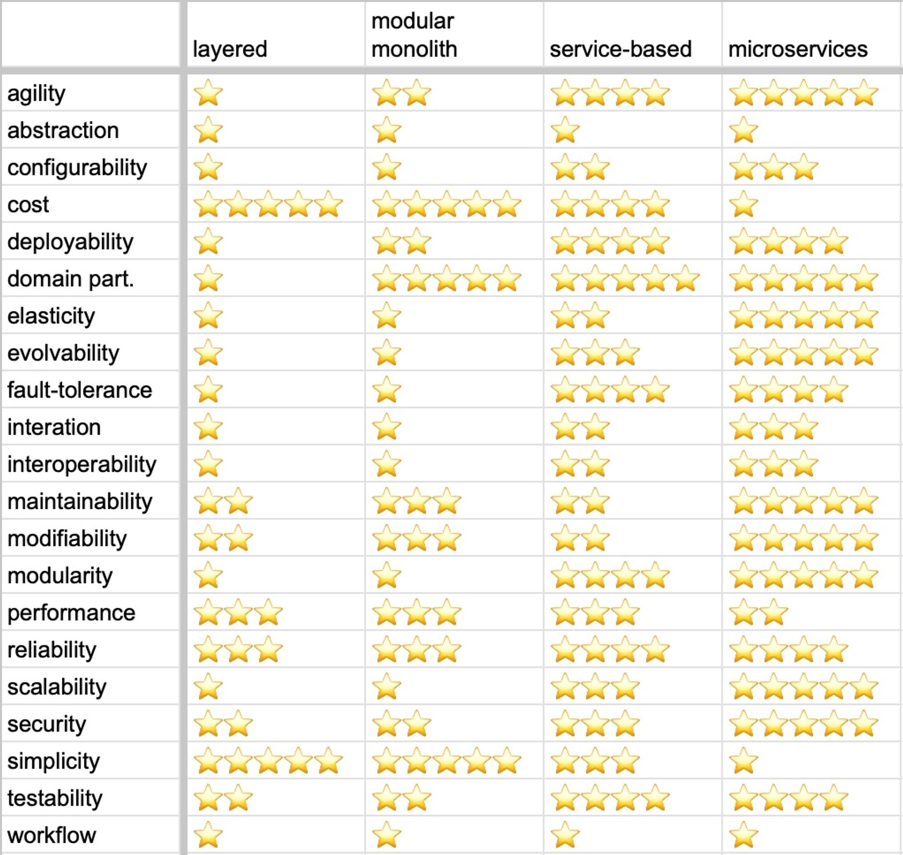

# Make cats free again (MCF). Step 2

## Стратегический анализ

### Поддомены

| Поддомен | Конкурентное преимущество | Сложность |  Изменчивость | Вид |
| --- | --- | --- | --- | --- |
| Подбор воркера под задачу | Да  | Высокая | Высокая | core |
| Найм воркеров | Да  | Высокая | Высокая | core |
| Выполнение задач | Нет  | Высокая | Низкая | generic |
| Мотивация менеджеров | Нет  | Средняя | Низкая | supporting |
| Повышение лояльности клиентов | Нет  | Низкая | Низкая | generic |

Почему так:

* `Подбор воркера под задачу` — пресловутый метчинг, интеллектуальная киллер-фича компании. Однозначный `core`.
* `Найм воркеров` — в требованиях написано про "кот входит в 3% лучших котов мира", это сложно, критерии могут часто меняться; тоже является конкурентным преимуществом. `core` поддомен.
* `Выполнение задач` — проблема, решенная много раз для каждой службы тех. поддержки; есть готовые конструкторы. `generic` поддомен.
* `Мотивация менеджеров` — сложная по сути штука, но реализация запрошена крайне простая. Схема немного серая, на аутсорс отдать не можем, но и конкурентных реимущест не дает. `supporting` поддомен.
* `Повышение лояльности клиентов` — решение отдано внешнему подрядчику. `generic` поддомен.

### Bounded contexts

В сравнении с ES из первого урока (которую, кстати, надо бы переделать) кое-что разошлось:

* Взаиморасчеты с клиентом и воркером разделились на 2 контекста. Это сделано для большей определенности, т.к. оба процесса использую +/- похожую терминологию (инвойс, например).
* Взаимодействие с поставщиком печенья выделилось в отдельный контекст, т.к. решает отдельную задаыу бизнеса по повышению лояльности клиентов.
* Контроль оказания услуг (с отметками воркера о начале и окончании работ) и контроль качества услуг объединил в один контекст.

## Event storming

Что сделал:

* Постарался убрать технические шаги.
* Переделал контексты в соответствии с bounded-contexts, найденными выше.

## Характеристики

Для ясности берем 12 основных характеристик из курса.

| Характеристика | Требуется | Откуда |
| --- | --- | --- |
| Availability | Нет |  |
| Scalability | Нет |  |
| Modifiability | Да | Для бизнеса критично проверять новые гипотезы по отсеву котов и изменять уже существующие с максимальной скоростью и надёжностью + US-060 |
| Maintainability | Да | Аналогично, проверки гипотез, возможные частые изменения |
| Securability | Нет | Не храним ПДН и прочей чувствительной информации |
| Performance | Нет | Заявленная нагрузка и кол-во пользователей не выглядит большим |
| Agility | Нет |  |
| Testability | Да | "Make software, not bullshit"(с) |
| Deployability | Да | Общее требование - низкий TTM |
| Usability | Да | Мы ж для пользователей стараемся, хоть явно это и не затребовано |
| Consistency | Не ясно | В требованиях не хватает данных |
| Simplicity | Нет | --- |

Основные характеристики системы: `Modifiability`, `Maintainability`, `Testability`, `Deployability`, `Usability` — следуют из общего требования низкого ТТМ и проверки гипотез.  

Разные контексты требуют дополнительных характеристик:

* Тестирование и отбор кандидатов — `Availability`, `Scalability` из-за требований US-080, US-081.
* Метчинг — `Securability` для защиты нашего конкурентного преимущества; `Agility` для обеспечения проверки гипотез.

## Арх стиль

Выбираю стиль на основе сравнительной таблицы.

Из выбранных характеристик следует, что нам подходят service-based или microservices стили.  

В ТЗ сказано, что заказчик не постоит за ценой, и команда будет набрана исходя из результатов моей работы.

Останавливаюсь на микросервисном стиле. Он дает большие результаты по характеристикам, связанным с изменениями, что может помочь нам в будущем при расширении бизнеса компании за пределы оказания услуг одним только котам-тестировщикам Happy Cat Box.
