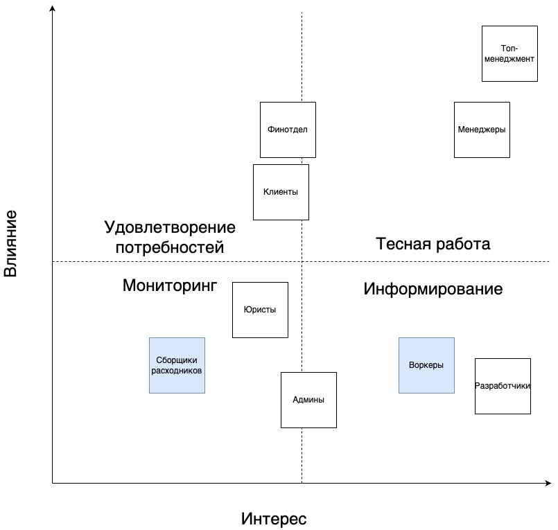

# Make cats free again (MCF). Step 3

## Стейкхолдеры

"Забытых" стейкхолдеров выделил цветом.  

Воркеры участвуют в процессе оказания услуг, их консерны могут повысить эффективность, но они не являются ключевыми.  

Сборщики расходников могут обладать полезной информацией о работе склада и могут помочь оптимизировать работу над заказом.

## Арх стиль

В предыдущей серии мы определились с поддоменами и контекстами.  

  

Так же был выбран микросервисный стиль для всей системы.  

Сервисы, их связи, стиль каждого сервиса и вид БД.  

  

Мотивация выделения сервисов:

* Расчеты с клиентами и воркерами делаю отдельными сервисами потому что там про бабки, бабки любят покой и одиночество.
* Метчинг — наша киллер-фича, она будет часто меняться, так что выделаю отдельно, чтобы не шатать всё остальное одновременно с проверкой гипотез.
* Тестирование кандидатов — еще одна киллер-фича, а кроме того — это сервис с внешним доступом, т.е. потенциальный вектор атаки и точка отказа под DDoS атаками китайских боевых утюгов-пылесосов.
* Мотивация менеджеров заявлена как "серая зона" и потенциальный источник интереса условной налоговой. Выделяю в отдельный сервис, чтобы не привлекать лишнее внимание ~~санитаров~~, и иметь возможность погасить его без вреда остальной системе.

Виды сервисов и БД:

* Задачи, контроль и расходники: модульный монолит с реляционной БД. Дешево, понятно, согласованно по данным.
* Метчинг: пайплайн и графовой БД. Алгоритм описан в требованиях как процесс последовательных шагов, что явно намекает на пайплайн. Проверка гипотез скорее всего будет выглядеть как добавление новых шагов или изменение их порядка, т.е. как некоторый DAG; графовая БД отлично подходит для работы с такими данными.
* Взаиморасчеты: 2 слоёных монолита с реляционными БД. Деньги, транзакции, связность — вот это вот всё.
* Тестирование и отбор: модельный монолит с релиционной БД. Может быть и microkernel, но из требований не ясна необходимость.  

## Виды коммуникаций

Синхронные коммуникации использую там, где для инициатора важен немедленный ответ от вызываемой системы: регистрация клиентов, метчинг, заказ печенья.  

В остальных случаях использую асинхронные коммуникации.

## Фитнес-функции

### Общие

* покрытие тестами;
* время выкатки релиза;
* периодичность релизов по сервисам (к разным сервисам есть разные требования);

### Тестирование и отбор

* SLA / SLI / SLO (провести нагрузочное тестирование сервиса и коммуникации с сервисом управления задачами)
