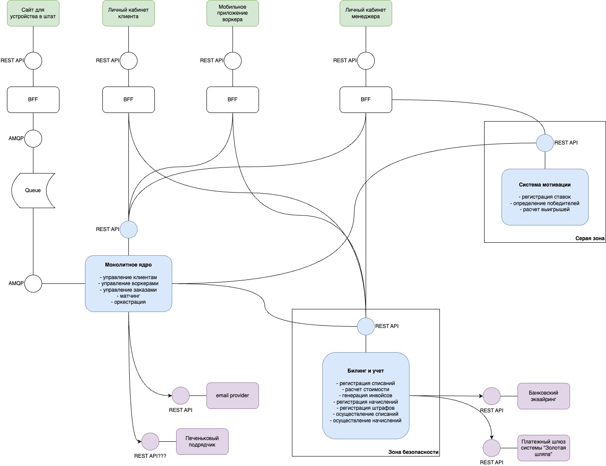
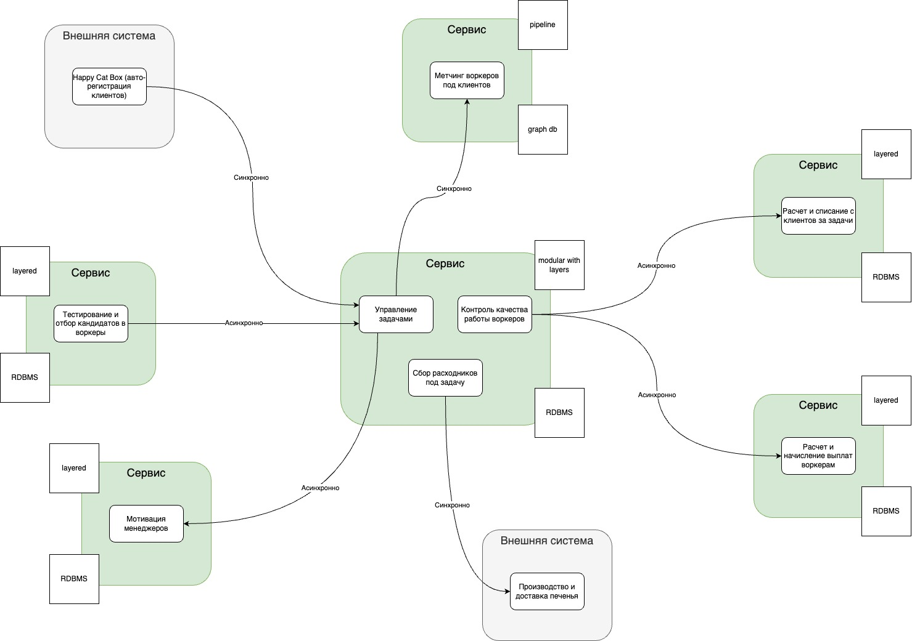

# Make cats free again (MCF). Step 4

## С чем работаем

### Система из нулевой домашки

### Система из третьей домашки

## Instability исходной системы

## Распиливаем

### Людей нет, ~~но вы держитесь~~ а ресурсов есть

Так получилось, что исходное решение состояло из 3х монолитных сервисов, но стиль решения все равно был распределенный.  

Будем начать с "простого"!  

#### Переносим расчет стоимости услуг

Так как процесс расчета не сложен и не содержит каких-то своих данных, переносим функционал по strangler fig application.

#### Разделение сервиса "Биллинга и учета"

В целевой картине биллинг и учет разделились на 2 контекста (а заодно и сервиса): взиморасчеты с клиентами и с воркерами.  

Используя tactical forking, разделяем сервис билинга и учета на 2 целевых:

* БД одинаковые;
* модели данных близкие;
* язык программирования один и тот же;
* процессы не меняются.

#### Выносим из "ядра" найм воркеров

В исходном решении планировалось использовать сайт только для сбора заявок и коммуникации с кандидатами, а всё самое интересное делать в ядре. Используя strangler fig application выносим весь процесс найма в отдельный сервис. Сайт, как внешний интерфейс, постепенно переводим на новый сервис через bff.

#### Метчинг

Т.к. в целевой картине система метчинга использует графовую БД, а мы изначально этого не планировали, мигрируем с помощью CDC.

### Люди есть, а ресурсов нет

#### Сперва метчинг

Выносим киллер-фичу первой, чтобы не блокировать развитие и тестирование гипотез.

#### Даем нанимать лучших котов

Следом выносим найм.

#### Далее по убывающей

Переносим на свои места менее критичные и не такие изменчивые штуки:

* расчет стоимостей;
* разделяем взаиморасчеты.
